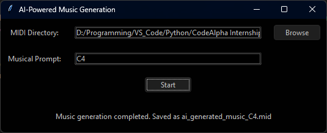

# AI-Powered Music Generator

An advanced AI-powered music generation system that uses deep learning techniques to compose original music. This tool utilizes Long Short-Term Memory (LSTM) neural networks to generate music sequences from MIDI files, with a user-friendly graphical interface.

## Features

- **MIDI File Processing:** Easily process MIDI files to extract musical notes and chords.
- **Sequence Generation:** Generate sequences of notes using LSTM-based neural networks.
- **Prompt-Based Music Composition:** Input musical prompts to guide the AI in generating specific music patterns.
- **Real-time Music Generation:** Compose and save original music compositions on the fly.
- **User-Friendly GUI:** Intuitive graphical interface for easy interaction with the AI music generator.

## Requirements

- Python 3.8 or higher
- TensorFlow 2.x
- Music21
- NumPy
- Tkinter (for GUI)

## Installation

1. Clone the repository:
    ```bash
    git clone https://github.com/yourusername/ai-music-generator.git
    cd ai-music-generator
    ```

2. Install the required Python packages:
    ```bash
    pip install tensorflow music21 numpy
    ```

3. (Optional) Set up a virtual environment for the project:
    ```bash
    python -m venv venv
    source venv/bin/activate  # On Windows, use `venv\Scripts\activate`
    ```

4. Download some MIDI files and place them in the `midi_files` directory within the project folder.

## Usage

### Running the Program

To run the program, use the following command:

```bash
python main.py
```

### Using the GUI

1. **Load MIDI Files:** Click on "Load MIDI Files" to process the MIDI files in the specified directory.
2. **Generate Music:** Input a musical prompt (e.g., `C4 E4 G4`) to guide the AI in generating a sequence.
3. **Save and Listen:** The generated music can be saved as a MIDI file and played back using any MIDI player.

### Example Prompts

- `C4 E4 G4` - A basic C major chord.
- `G4 B4 D5` - A basic G major chord.
- `A3 C4 E4` - A basic A minor chord.

## Technical Details

### Preprocessing MIDI Files

The system processes MIDI files to extract musical notes, chords, and rests. This information is used to train the LSTM model.

### Sequence Generation

The LSTM model takes the preprocessed notes and generates sequences of musical notes. The sequences are used to compose original music.

### GUI Implementation

The graphical user interface is built using Tkinter, providing an easy way to interact with the AI model, load MIDI files, input musical prompts, and generate new compositions.

## Example



## Issues and Contributions

If you encounter any issues or have ideas for improvements, please feel free to open an issue or contribute to the project by submitting a pull request.

## License

This project is licensed under the MIT License - see the [LICENSE](LICENSE) file for details.
